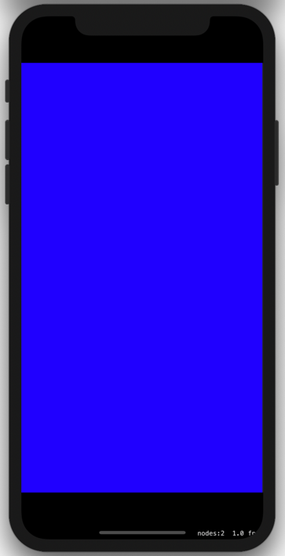
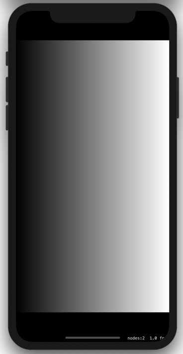

# Examples
## Everything blue
Colors every pixel in blue.


```GLSL
// shader.fsh
void main() {
    // colors everything blue with 100% opacity
    // RBG(0.0, 0.0, 1.0) = blue
    vec3 color = vec3(0.0, 0.0, 1.0);
    float alpha = 1.0;
    
    gl_FragColor = vec4(color, alpha);
}
```

## Black and white gradient
A black and white gradient from left to right using the ```position.x``` coordinate. For a gradient from top to bottom the ```position.y``` coordinate can be used.



```GLSL
// shader.fsh
void main() {
  // u, v position - 0,0 is in the bottom left
  vec2 position = v_tex_coord;

  // creates a black-white gradient from left to right
  // RGB (0.0, 0.0, 0.0) is black, (1.0, 1.0, 1.0) is white, 
  vec3 color = vec3(position.x);
  float alpha = 1.0;

  gl_FragColor = vec4(color, alpha);
}
```
