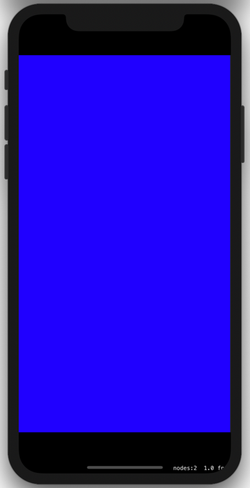
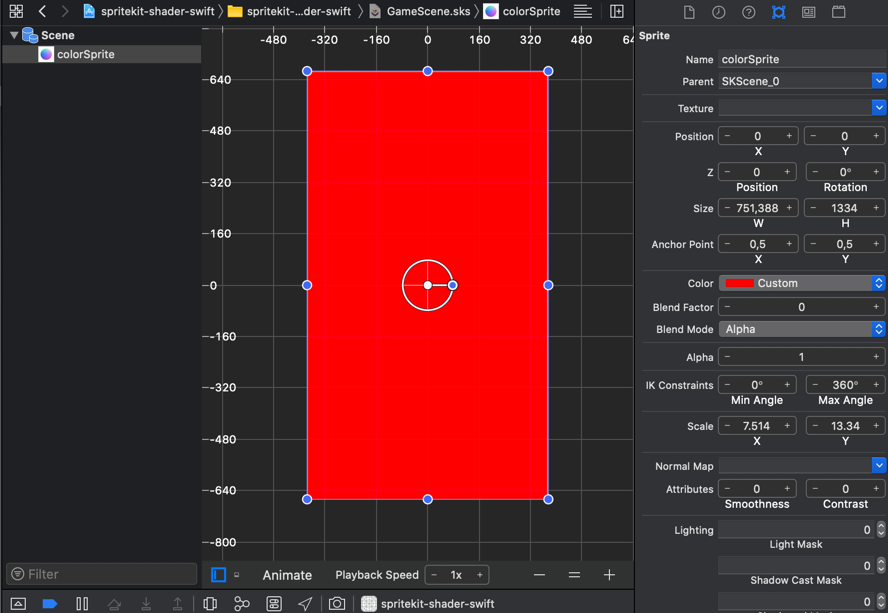

# Hello World
This example renders a red color sprite (SKSpriteNode) in blue.

## Result


## GameScene Setup
The color sprite was created inside **GameScene.sks**.



## Code
### Scene
```Swift
// GameScene.swift
import SpriteKit
import GameplayKit

class GameScene: SKScene {

    var colorSprite: SKSpriteNode! = nil

    override func didMove(to view: SKView) {
        colorSprite = childNode(withName: "colorSprite") as? SKSpriteNode
        let shader = SKShader(fileNamed: "shader-blue")
        colorSprite.shader = shader
    }
}
````
### Shader
The shader coding is the following:
```GLSL
// shader-blue.fsh
void main() {
    // colors everything blue with 100% opacity
    gl_FragColor = vec4(0.0, 0.0, 1.0, 1.0);
}
```


